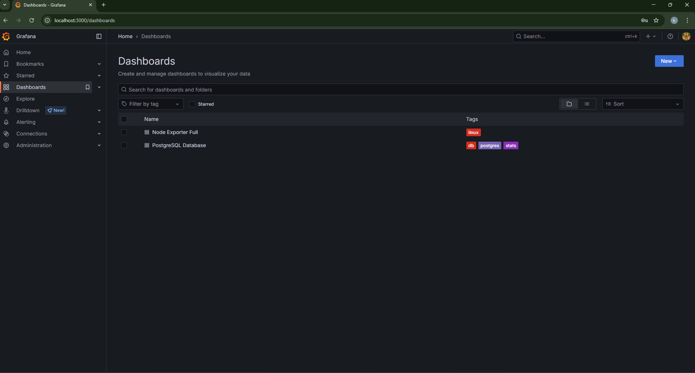
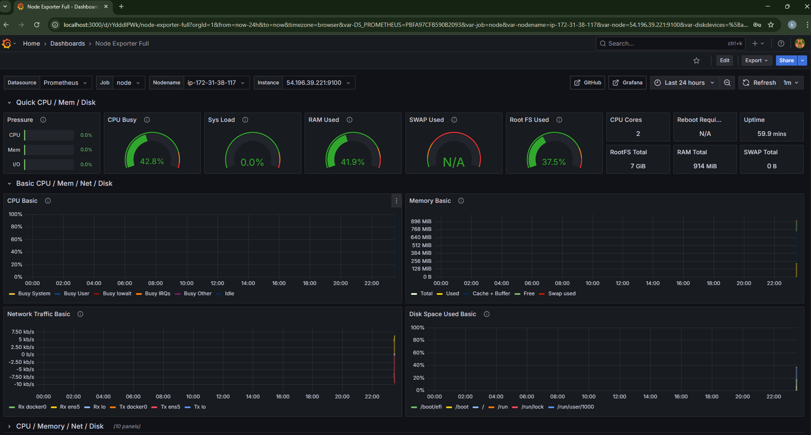
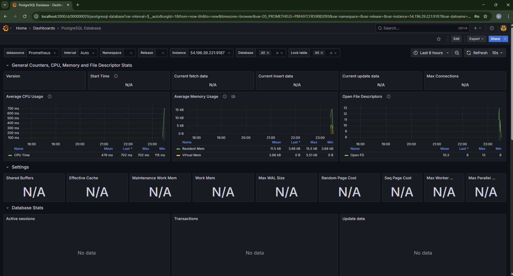
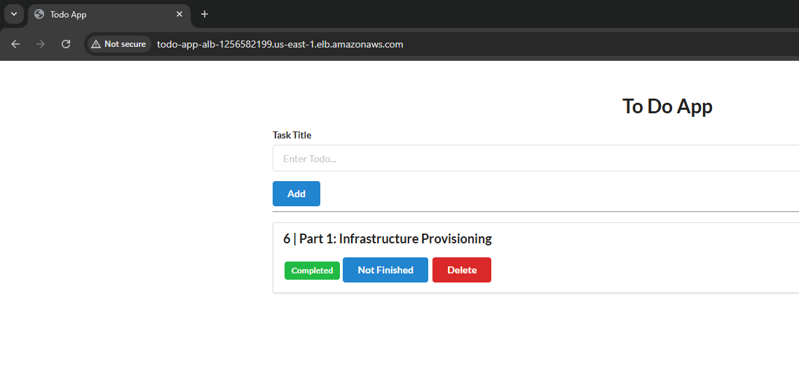

# 📝 Todo-List-Dockerized-Flask-WebApp

This is a simple **Flask** web application for managing TODO tasks, backed by a **PostgreSQL** database and containerized using **Docker**. It's ready for both local development and production deployment via `docker-compose`.

---

## 🚀 Getting Started

### Clone the Repo
```bash
# clone the repo into your local host
$ git clone https://github.com/koushik2316/Octa-Byte_Assement
$ cd  Octa-Byte_Assement
```
### To Run Locally with Docker Compose 
### Start the App
```bash
$ docker-compose up --build
```

### Access the App
``` bash
  Access the app at: http://localhost:5000
```

### To Run Locally without Docker Compose 
### 🔁 Create a Shared Network
```bash
$ docker network create todo-network
```

### 🐘  Run PostgreSQL Container

``` bash
$ docker run -d \
  --name postgres-db \
  --network todo-network \
  -e POSTGRES_USER=postgres \
  -e POSTGRES_PASSWORD=password \
  -e POSTGRES_DB=todoapp \
  postgres
```
### Run Your Flask App Container
``` bash
$ docker run -d \
  --name flask-app \
  --network todo-network \
  -e POSTGRES_USER=postgres \
  -e POSTGRES_PW=password \
  -e POSTGRES_URL=postgres-db:5432 \
  -e POSTGRES_DB=todoapp \
  -p 5000:5000 \
  koushikn23/todo-flask-app:latest #dockehubusername/image:tag
```
### Access the App
``` bash
  Access the app at: http://localhost:5000
```
---
### 🚀 CI/CD Pipeline for Flask TODO App

This document describes the GitHub Actions-based CI/CD pipeline built as part of **Deployment Automation**. It includes test automation, Dockerization, vulnerability scanning, deployment to staging and production, and failure notifications.

---

## 🔁 Pipeline Breakdown

### ✅ 1. Test Workflow (on Pull Request)
- Trigger: `on: pull_request`
- Steps:
  - Install dependencies
  - Run unit tests using `pytest`
- Purpose: Validate code correctness before merging

### 🏗️ 2. Build & Deploy Workflow (on Push to main)
- Trigger: `on: push` to `main`
- Stages:
  - **Build Docker Image**
  - **Push Image to Docker Hub**
  - **Trivy Vulnerability Scan** (Python dependencies + Docker image)
  - **Deploy to Staging**: Auto-deployment
  - **Manual Approval → Deploy to Production**

### 📣 3. Failure Notifications
- **Slack Notification** (via webhook) to `#ci-cd` channel
- **Email Notification** (via Gmail App Password) on failures

## 🔐 Required GitHub Secrets

| Secret Name         | Description                       |
|---------------------|-----------------------------------|
| `DOCKER_USERNAME`   | Docker Hub username               |
| `DOCKER_PASSWORD`   | Docker Hub password or token      |
| `EMAIL_USERNAME`    | Gmail address (sender)            |
| `EMAIL_PASSWORD`    | Gmail App Password                |
| `SLACK_WEBHOOK_URL` | Slack Incoming Webhook URL        |

---

### Monitoring and Logging

This section describes the monitoring and logging setup implemented for the Flask TODO application hosted on an EC2 instance with a PostgreSQL database on Amazon RDS.

## ✅ Monitoring Stack
We used Prometheus + Grafana for monitoring and node_exporter + postgres_exporter for metric collection.

| Component          | Purpose                                  |
| ------------------ | ---------------------------------------- |
| Prometheus         | Time-series database and monitoring tool |
| Grafana            | Dashboard and visualization tool         |
| node\_exporter     | Collects system metrics from EC2         |
| postgres\_exporter | Collects metrics from PostgreSQL (RDS)   |

## 📊 Dashboards (Grafana)

Two meaningful dashboards are configured:

 1. EC2 System Dashboard 
     * CPU usage, memory, disk, load average

 2. PostgreSQL Metrics
     * Query count, connections, cache hit ratio, query duration

---
## ❗ Challenges & Resolutions

| Challenge                                  | Resolution                                                                  |
| ------------------------------------------ | --------------------------------------------------------------------------- |
| Promtail bind mount error                  | Removed Loki + Promtail due to directory mapping issues                     |
| Trivy vulnerabilities in Docker base image | Switched to `python:3.10-slim` and pinned dependencies                      |
| Prometheus not scraping RDS                | Opened SG on port `9187` and validated exporter on EC2                      |
| SSH deployment automation                  | Used GitHub Secrets to store EC2 private key and deployed using `scp + ssh` |
| Manual production deployment step          | Used `workflow_dispatch` + `environments.production` with approval gate     |

---

## Dashboard Screenshots

  

  

  


## Features
- Add new tasks.
- Mark task as finished/unfinished.
- Delete a task.
<br>


